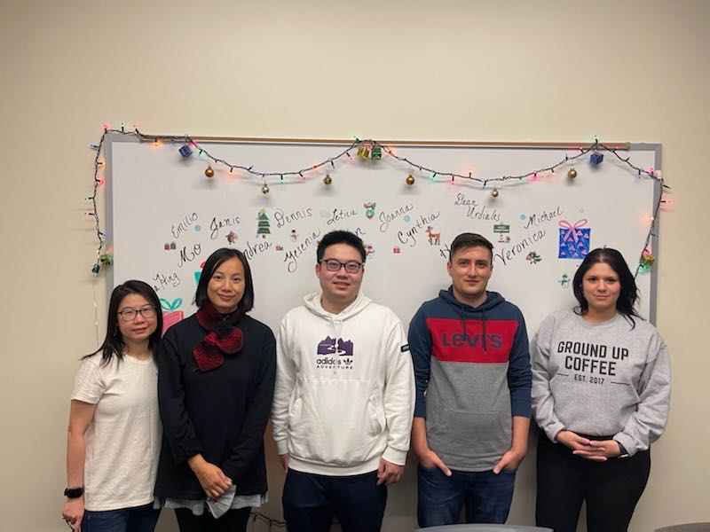

# User_Page
My name is *Ka Wing Yan*, And you can call me **Terry**.
>Computer engineering student at UC San Diego





Some basic computer language are learned:
```
Python
Java
C
C++
SystemVerlog

```
Space time activity:
- Hilking
- Playing game
- Watching Movie
- Cooking
### Before Graduation

- [x] Meet more friends
- [ ] Work team projects
- [ ] get internships

## Working Experiences
### **Student Assistant in ELAC**
Job descrption:
1. supporting multiple department
2. Helping college staff, professor
3. Working with different ethnicity
4. Help Non-english student to translation 

[README.md](README.md)

[Read Me Again](https://github.com/TerryYan26/CSE-110/blob/VS-UI/index.md#User_Page) :)
